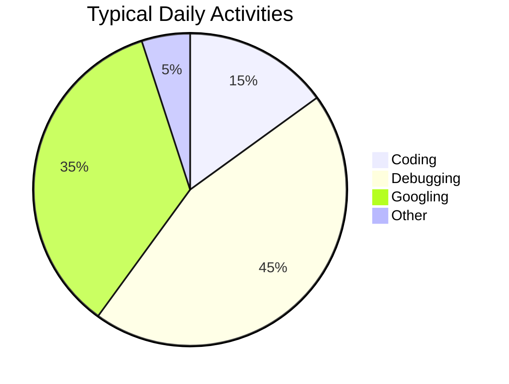

## Hi , 

<!--  -->

<!-- ## Check out: -->

I am a software engineer with 1+ year experience in building web apps. I love to code and really enjoy solving problems and collatorating with my peers.

I have deployed several sites some of which am showcasing in the <a href="#sample-projects">Sample Projects</a> section.

#### Top Technologies

 

### 📊 Monthly development breakdown

<!--START_SECTION:waka-->

<!--END_SECTION:waka-->

### Experience

  
  
  
  
  
  <!--  -->
  
 
<!--  -->
  

<!--
<h2 id="sample-projects">Projects</h2>
<table>
  <tbody>
    <tr>
      <td>
        
      </td>
      <td>
        <a href="https://restaurant-ecommerce.netlify.app/"
          >Restaurant E-commerce site</a>
           
           
          
      </td>
      <td>
        
      </td>
      <td>
        <a href="https://hampi-tourism-site-hb.netlify.app/"
          >Tourism Hampi</a>
            
           
          
      </td>
    </tr>
    <tr>
      <td>
        
      </td>
      <td>
        <a href="https://video-app-hb.netlify.app/">Video App</a>
         
           
          
      </td>
      <td>
        <a href="https://chat-app-merng.netlify.app/">
                
      </td>
      <td>
        <a href="https://chat-app-merng.netlify.app/">Chat App</a>
         </a>
          
           
          
      </td>
    </tr>
    <td>
      
    </td>
    <td>
      <a href="https://dating-site-frontend.netlify.app/">Dating Site</a>
       </a>
          
           
          
    </td>
    <td>
      
    </td>
    <td>
      <a href="https://salad-hb.netlify.app/">Salad site</a>
       </a>
          
           
          
    </td>
    </tr>
    <tr>
      <td>
        
      </td>
      <td>
        <a href="https://agency-site-hb.netlify.app">Agency Site</a>
         </a>
          
           
          
      </td>
      <td>
        
      </td>
      <td>
        <a href="https://portfolio-hb.netlify.app/">Sample Portfolio</a>
         </a>
          
           
          
      </td>
    </tr>
     <tr>
       <td>
        
      </td>
      <td>
        <a href="https://recipes-homemade-hb.netlify.app/">Recipes Homemade</a>
         </a>
          
           
          
      </td>
      <td>
        
      </td>
      <td>
        <a href="https://messaging-app-frontend.web.app/">Messaging App</a>
         </a>
          
           
          
      </td>        
    </tr>
  </tbody>
</table>

 -->

  <h2>Certifications</h2>  
<table>
  <tbody>
    <tr>
      <td>
        
      </td>
      <td>
        <a href="https://www.hackerrank.com/certificates/229ef084f60a"
          >Verify</a
        >
      </td>
      <td>
        
      </td>
      <td>
        <a href="https://www.hackerrank.com/certificates/12d1fbc424ce"
          >Verify</a
        >
      </td>
    </tr>
    <tr>
      <td>
        
      </td>
      <td>
        <a href="https://www.codechef.com/certificates/verify">Verify</a>
        
<b>Certificate ID:</b> 94a6f28

        
<b>Username:</b> rashidali001

      </td>
      <td>
        
      </td>
      <td>
        <a href="https://hb-rashidali001.netlify.app/#certification">Verify</a>
      </td>
    </tr>
    <tr>
      <td>
        
      </td>
      <td>
        <a
          href="https://www.freecodecamp.org/certification/rashidali001/front-end-development-libraries"
          >Verify</a
        >
      </td>
      <td>
        
      </td>
      <td>
        <a
          href="https://www.freecodecamp.org/certification/rashidali001/javascript-algorithms-and-data-structures"
          >Verify</a
        >
      </td>
    </tr>
    <tr>
      <td>
        
      </td>
      <td>
        <a
          href="https://www.freecodecamp.org/certification/rashidali001/responsive-web-design"
          >Verify</a
        >
      </td>
      <td>
        
      </td>
      <td>
        <a href="https://hb-rashidali001.netlify.app/#certification">Verify</a>
      </td>
    </tr>
    <tr>
      <td>
        
      </td>
      <td>
        <a href="https://hb-rashidali001.netlify.app/#certification">Verify</a>
      </td>
      <td>
        
      </td>
      <td>
        <a href="https://hb-rashidali001.netlify.app/#certification">Verify</a>
      </td>
    </tr>
    <tr>
    <td>
        
      </td>
      <td>
        <a href="https://hb-rashidali001.netlify.app/#certification">Verify</a>
      </td>
      <td>
        
      </td>
      <td>
        <a href="https://hb-rashidali001.netlify.app/#certification">Verify</a>
      </td>
    </tr>
     <tr>
    <td>
        
      </td>
      <td>
        <a href="https://code.org/congrats?i=_1_18e783d40c7c6f10271c6612c21a4c65">Verify</a>
      </td>
     </tr>
  </tbody>
</table>

</h2>

<h3 align="center" style="color:yellow;margin-bottom: 20px;" >Let's Connect </h3>  

  &nbsp;&nbsp;
  &nbsp;&nbsp;
 &nbsp;&nbsp;
 &nbsp;&nbsp;
   &nbsp;&nbsp;

  &nbsp;&nbsp;
  &nbsp;&nbsp;
 &nbsp;&nbsp;
 &nbsp;&nbsp;

<!-- <h1> Skills</h1>

 -->
<!--
<h2>
  

    
Tools

    

  

 </h2> -->

<!-- 

 -->

## Contribution Graph

  

&nbsp;
 

### 🏆 <!--My Trophies-->

<!--### Github Stats-->

      

<!--### Github extra pins-->

### Unique Views

  

### 😂 Here is a random joke for you today: -

### Star my projects [here](https://github.com/rashidali001?tab=repositories)
